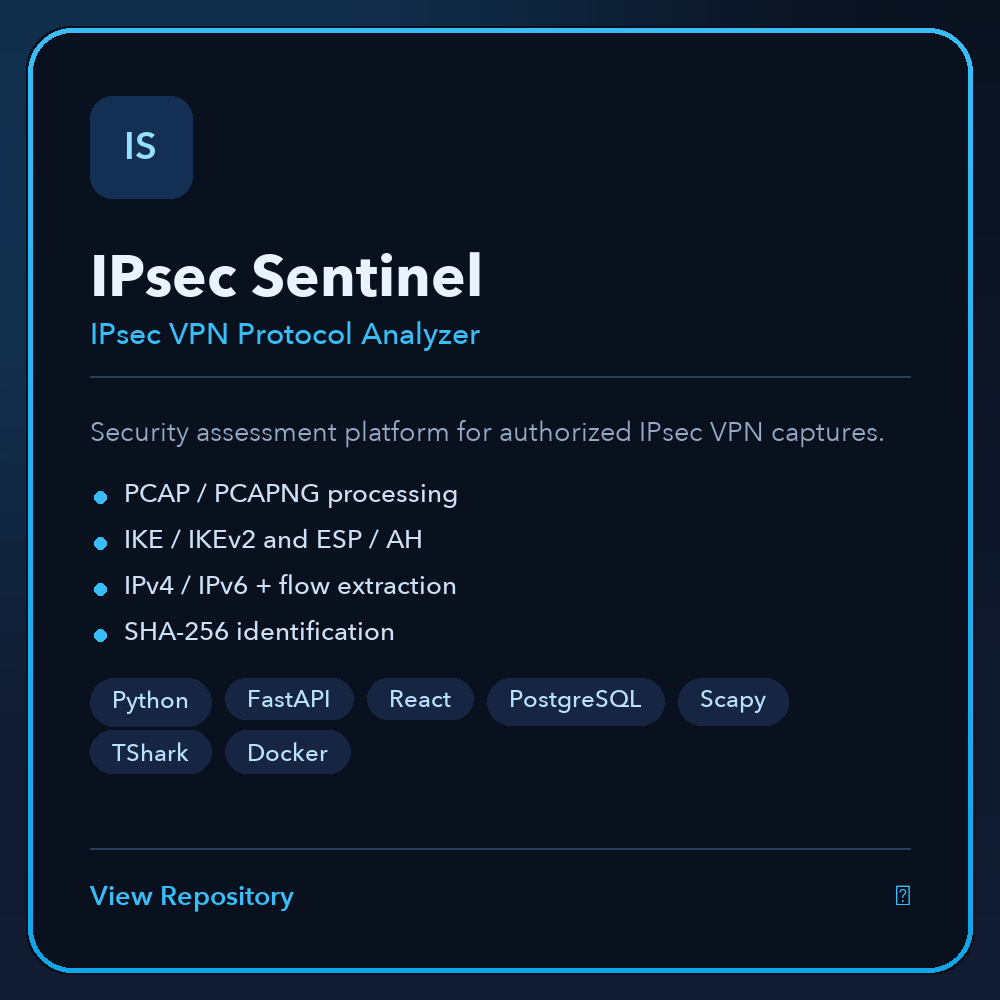
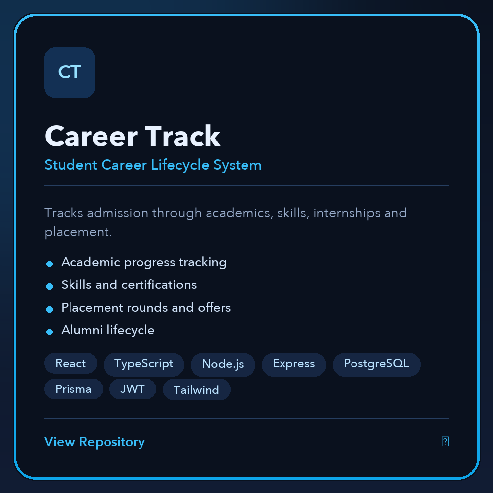
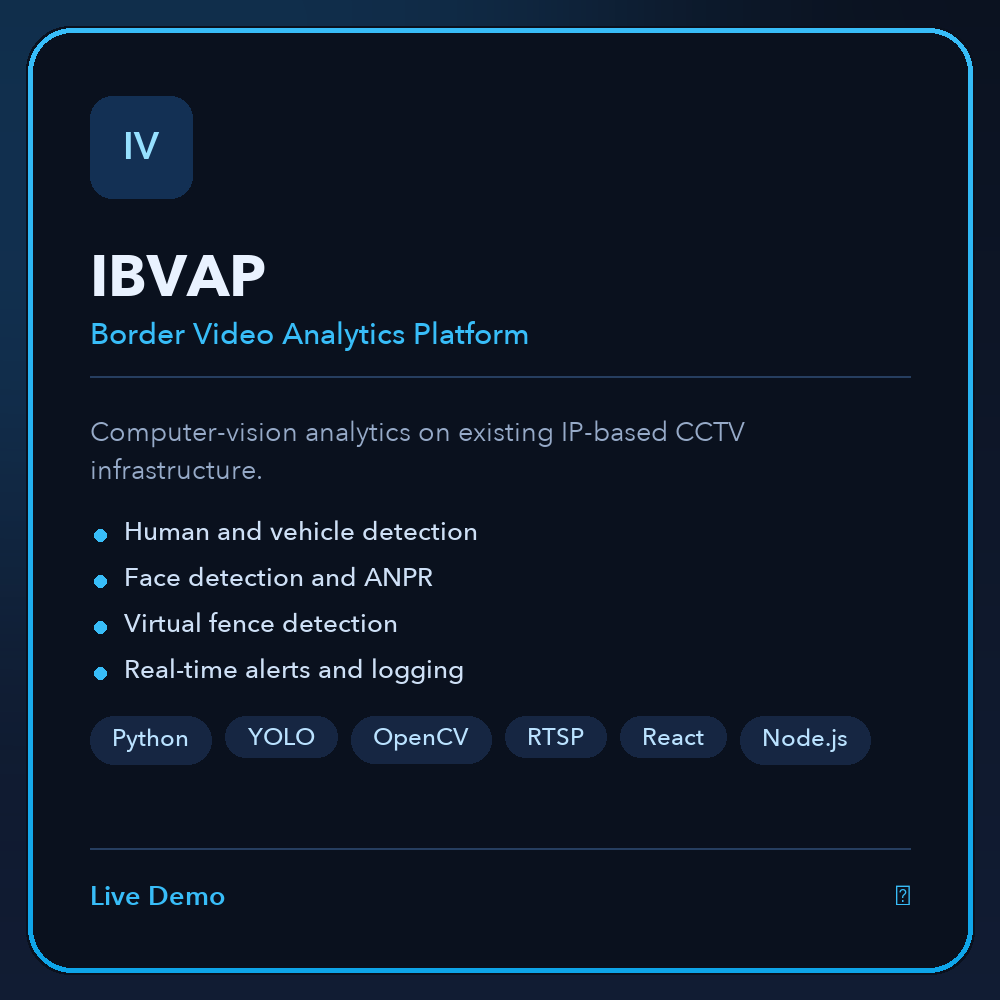
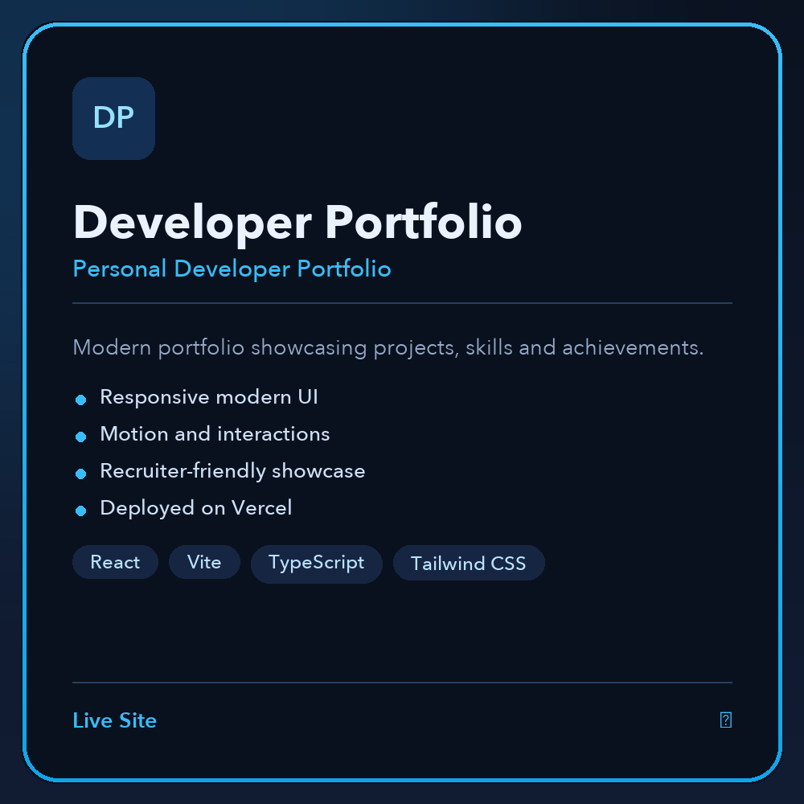
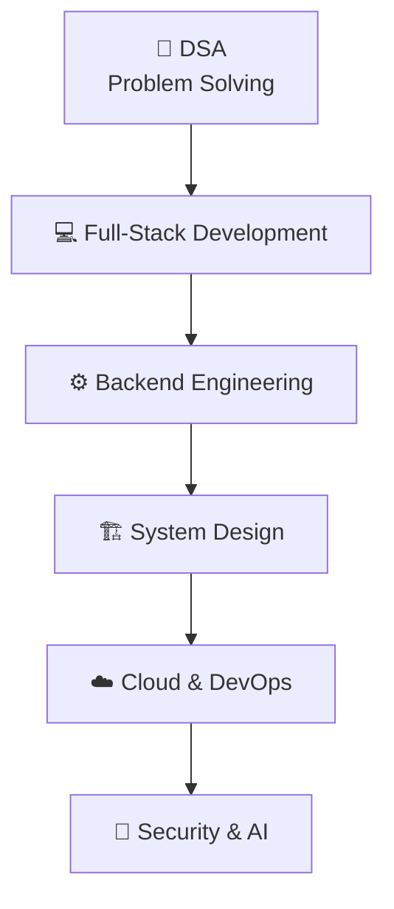

 

 

&nbsp;

&nbsp;

 

---

## 👨‍💻 About Me

- 🔭 Currently building **IPsec Sentinel** — an AI-powered IPsec VPN protocol analyzer & security assessment framework
- ☁️ Serving as **Technical Lead — AWS Cloud Club** at Graphic Era Hill University
- 🧠 Passionate about **Full-Stack Development**, **Backend Engineering**, **Cloud Computing** & **Cybersecurity**
- 🌱 Currently learning **System Design**, **AWS**, **Docker**, **Kubernetes**, **CI/CD** & backend architecture
- ⚙️ I enjoy building **APIs, distributed services, real-time dashboards and security tooling**
- 💻 Solved **350+ LeetCode problems** with a peak rating of **1624**
- 🏆 **Hackathon Finalist** — shipping prototypes under real deadlines

---

## 🚀 Featured Projects

---

## 🛠️ Tech Stack

**💻 Languages**

**🎨 Frontend**

**⚙️ Backend**

**🗄️ Databases**

**☁️ Cloud & DevOps**

**🔧 Tools**

---

## 🎯 Current Focus

**🧩 DSA**
Problem Solving · Algorithms · Data Structures

**⚙️ Backend Engineering**
REST APIs · Authentication · Scalable Services

**🏗️ System Design**
Architecture · Low-Level Design · Scalability

**☁️ Cloud &amp; DevOps**
AWS · Docker · Kubernetes · CI/CD

**🔐 Security**
Networking · IPsec · Cybersecurity

---

## 📊 GitHub Analytics

---

## 🐍 Contribution Snake

<picture>
  <source
    media="(prefers-color-scheme: dark)"
    srcset="https://raw.githubusercontent.com/Tapas193/Tapas193/output/github-contribution-grid-snake-dark.svg"
  />

  <source
    media="(prefers-color-scheme: light)"
    srcset="https://raw.githubusercontent.com/Tapas193/Tapas193/output/github-contribution-grid-snake.svg"
  />

  
</picture>

---

## 🏆 Highlights

- 🏆 **Hackathon Finalist** — shipped working prototypes under real deadlines
- ☁️ **Technical Lead — AWS Cloud Club** — Graphic Era Hill University
- 💻 **350+ LeetCode Problems Solved**
- 🧠 **Max LeetCode Rating — 1624** (personal best)
- 🏅 **LeetCode 100 Days Badge** — 100 days of consistent solving
- 📚 **NPTEL Certification** — formal coursework completed
- 🎓 **B.Tech — CSE**, Graphic Era Hill University

---

## ☁️ Leadership

### Technical Lead — AWS Cloud Club

Graphic Era Hill University

Leading a student community around practical cloud engineering — running hands-on sessions, mentoring student projects and pushing members toward real deployments.

**Focus** — ☁️ Cloud Computing · 🅰️ AWS · 🛠️ DevOps · 🐧 Linux · 🐳 Docker · ☸️ Kubernetes · ⚡ CI/CD

**Community** — 🧑‍🏫 Technical workshops · 🛠️ Student projects · 🏁 Hackathons · 🤝 Peer mentorship

---

## 🧭 Developer Journey

From solving problems → building products → designing systems → shipping to the cloud.

---

## 🤝 Connect With Me

&nbsp;&nbsp;

&nbsp;&nbsp;

&nbsp;&nbsp;

Open to collaborations, open-source contributions and internship opportunities.

---

Turning ideas into real-world software, one project at a time. 🚀
