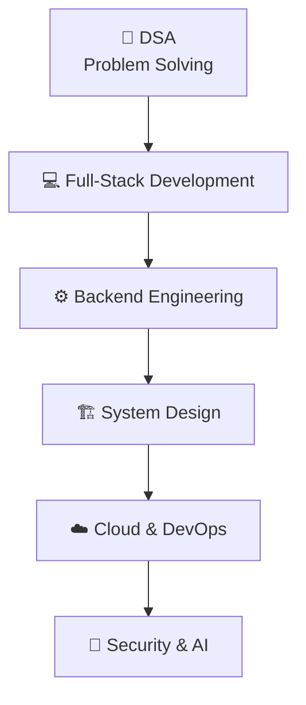

 

 

&nbsp;

&nbsp;

 

---

## 👨‍💻 About Me

- 🔭 Currently building **IPsec Sentinel** — an AI-powered IPsec VPN protocol analyzer & security assessment framework
- ☁️ Serving as **Technical Lead — AWS Cloud Club** at Graphic Era Hill University
- 🧠 Passionate about **Full-Stack Development**, **Backend Engineering**, **Cloud Computing** & **Cybersecurity**
- 🌱 Currently learning **System Design**, **AWS**, **Docker**, **Kubernetes**, **CI/CD** & backend architecture
- ⚙️ I enjoy building **APIs, distributed services, real-time dashboards and security tooling**
- 💻 Solved **350+ LeetCode problems** with a peak rating of **1624**
- 🏆 **Hackathon Finalist** — shipping prototypes under real deadlines
- 🎯 **President — We Code Club**, running peer learning and technical workshops

---

## 🚀 Featured Projects

<table>
<tr>

<td width="50%" valign="top">

<h3 align="left">🔐 IPsec Sentinel</h3>

<b>AI-Powered IPsec VPN Protocol Analyzer &amp; Security Assessment Framework</b>

A security assessment platform that analyzes authorized IPsec VPN captures and extracts protocol, network-flow and security information.

<b>Highlights</b> 
📦 PCAP / PCAPNG processing 
🛡️ Secure upload validation &amp; SHA-256 identification 
🔐 IKE / IKEv2 analysis &amp; ESP / AH detection 
🌐 IPv4 / IPv6 analysis &amp; network flow extraction 
📊 Security assessment dashboard

<b>Tech</b> 
<code>Python</code> <code>FastAPI</code> <code>React</code> <code>PostgreSQL</code> 
<code>Scapy</code> <code>TShark</code> <code>Docker</code>

 

</td>

<td width="50%" valign="top">

<h3 align="left">🎓 Career Track</h3>

<b>Student Career Lifecycle Tracking System</b>

A platform tracking the student journey from admission through academics, skills, projects, internships, placement and alumni.

<b>Highlights</b> 
👨‍🎓 Student profiles &amp; academic progress 
🧠 Skills and certifications 
💻 Projects &amp; internships 
🏢 Placement rounds, offers &amp; alumni lifecycle

<b>Tech</b> 
<code>React</code> <code>TypeScript</code> <code>Node.js</code> <code>Express</code> 
<code>PostgreSQL</code> <code>Prisma</code> <code>JWT</code> <code>Tailwind CSS</code>

 

</td>

</tr>

<tr>

<td width="50%" valign="top">

<h3 align="left">🛡️ IBVAP</h3>

<b>Intelligent Border Video Analytics Platform</b>

Computer-vision surveillance analytics built around existing IP-based CCTV infrastructure.

<b>Highlights</b> 
👤 Human detection &amp; tracking 
🚗 Vehicle detection &amp; classification 
🔢 Face detection &amp; ANPR 
🚧 Virtual fence &amp; suspicious activity detection 
🌙 Night movement detection, alerts &amp; event logging

<b>Tech</b> 
<code>Python</code> <code>YOLO</code> <code>OpenCV</code> <code>RTSP</code> 
<code>React</code> <code>Node.js</code>

 

</td>

<td width="50%" valign="top">

<h3 align="left">💻 Developer Portfolio</h3>

<b>Personal developer portfolio</b>

A modern portfolio showcasing projects, technical skills and achievements.

<b>Focus</b> 
🎨 Clean, responsive UI 
✨ Motion &amp; interaction design 
🚀 Recruiter-friendly project showcase

<b>Tech</b> 
<code>React</code> <code>Vite</code> <code>TypeScript</code><code>Tailwind CSS</code>

 

</td>

</tr>
</table>

---

## 🛠️ Tech Stack

**💻 Languages**

**🎨 Frontend**

**⚙️ Backend**

**🗄️ Databases**

**☁️ Cloud & DevOps**

**🔧 Tools**

---

## 🎯 Current Focus

<table>
<tr>
<td align="center" valign="top" width="20%">  <h3>🧩 DSA</h3>Problem Solving Algorithms Data Structures</td>
<td align="center" valign="top" width="20%">  <h3>⚙️ Backend</h3>REST APIs Authentication Scalable Services</td>
<td align="center" valign="top" width="20%">  <h3>🏗️ System Design</h3>Architecture Low-Level Design Scalability</td>
<td align="center" valign="top" width="20%">  <h3>☁️ Cloud &amp; DevOps</h3>AWS Docker Kubernetes CI/CD</td>
<td align="center" valign="top" width="20%">  <h3>🔐 Security</h3>Networking IPsec Cybersecurity</td>
</tr>
</table>

---

## 📊 GitHub Analytics

---

## 🐍 Contribution Snake

<picture>
  <source
    media="(prefers-color-scheme: dark)"
    srcset="https://raw.githubusercontent.com/Tapas193/Tapas193/output/github-contribution-grid-snake-dark.svg"
  />

  <source
    media="(prefers-color-scheme: light)"
    srcset="https://raw.githubusercontent.com/Tapas193/Tapas193/output/github-contribution-grid-snake.svg"
  />

  
</picture>

---

## 🏆 Highlights

<table>
<tr>
<td align="center" valign="top" width="33%">🏆 <b>Hackathon Finalist</b> Shipped working prototypes under real deadlines</td>
<td align="center" valign="top" width="33%">☁️ <b>Technical Lead — AWS Cloud Club</b> Graphic Era Hill University</td>
<td align="center" valign="top" width="33%">🎯 <b>President — We Code Club</b> Peer learning &amp; technical workshops</td>
</tr>
<tr>
<td align="center" valign="top" width="33%">💻 <b>350+ LeetCode Problems</b> Consistent daily practice</td>
<td align="center" valign="top" width="33%">🧠 <b>Max LeetCode Rating — 1624</b> Personal best rating</td>
<td align="center" valign="top" width="33%">🏅 <b>LeetCode 100 Days Badge</b> 100 days of consistent solving</td>
</tr>
<tr>
<td align="center" valign="top" width="33%">📚 <b>NPTEL Certification</b> Formal coursework completed</td>
<td align="center" valign="top" width="33%">🎓 <b>B.Tech — CSE</b> Graphic Era Hill University</td>
<td align="center" valign="top" width="33%"> &nbsp;</td>
</tr>
</table>

---

## ☁️ Leadership

### Technical Lead — AWS Cloud Club

Graphic Era Hill University

Leading a student community around practical cloud engineering — running hands-on sessions, mentoring student projects and pushing members toward real deployments.

<table>
<tr>
<td align="center" valign="top"><b>Domains</b> ☁️ Cloud Computing 🅰️ AWS 🛠️ DevOps 🐧 Linux 🐳 Docker ☸️ Kubernetes ⚡ CI/CD</td>
<td align="center" valign="top"><b>Community</b> 🧑‍🏫 Technical workshops 🛠️ Student projects 🏁 Hackathons 🤝 Peer mentorship</td>
</tr>
</table>

### President — We Code Club

Leading the club's coding culture — problem-solving sessions, collaborative building and event coordination.

---

## 🧭 Developer Journey

From solving problems → building products → designing systems → shipping to the cloud.

---

## 🤝 Connect With Me

&nbsp;&nbsp;

&nbsp;&nbsp;

&nbsp;&nbsp;

Open to collaborations, open-source contributions and internship opportunities.

---

Turning ideas into real-world software, one project at a time. 🚀
